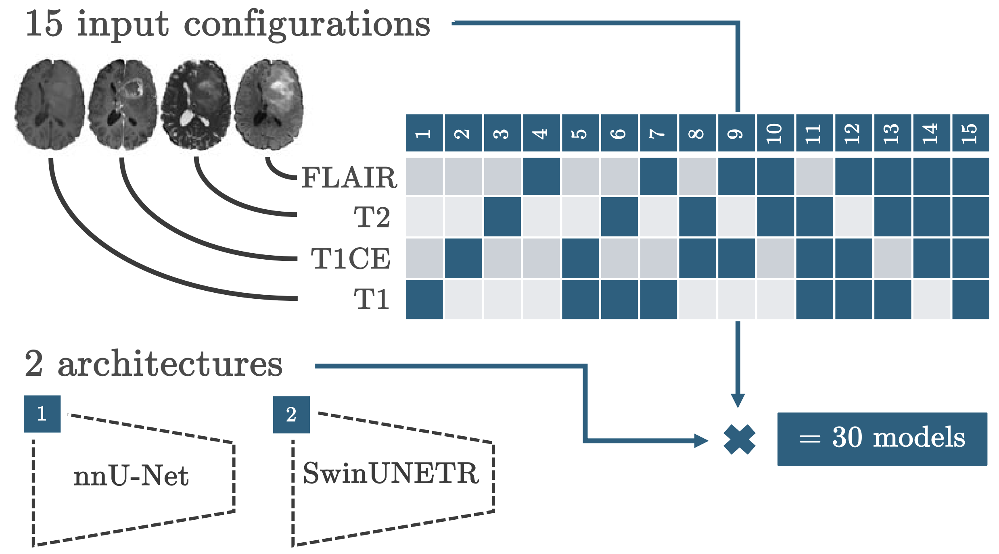

# MRI-based glioblastoma segmentation

This repository contains the code used for the segmentation models discussed in the paper:

#### [Modality redundancy for MRI-based glioblastoma segmentation](https://doi.org/10.1007/s11548-024-03238-4)

Automated glioblastoma segmentation from MRI is commonly performed using multiple input modalities, typically T1-weighted, contrast-enhanced T1-weighted, T2-weighted, and FLAIR images, but they may also contain redundant information. In clinical practice, not all modalities may be available for every patient.

This repository contains the code and trained models used to evaluate how different MRI modality combinations affect automated glioblastoma segmentation. Model were trained on the [BraTS2021](https://www.kaggle.com/datasets/dschettler8845/brats-2021-task1) dataset using various combinations of input modalities and two network architectures: nnU-Net and SwinUNETR. Implementations were made using [MONAI](https://github.com/Project-MONAI) version 1.2.0.

<!--  -->

## Training script

This repository is provided for reproducibility and is not actively maintained.

The training script is found under `training.py`. The architecture and modality configuration can be selected by adapting variables `arch` and `modalities` accordingly.

## Trained models

The trained models covering all modality configurations and both network architectures can be downloaded [here](https://drive.google.com/drive/folders/15tiAk2PcOAgedWPIRqg0HGwkklxRA1mO?usp=sharing).  

## Citation

If you use this repository, please cite:

*De Sutter, S., Wuts, J., Geens, W. et al. Modality redundancy for MRI-based glioblastoma segmentation. Int J Comput Assist Radiol Surg. 19 (10): 2101-2109 (2024). https://doi.org/10.1007/s11548-024-03238-4* 
